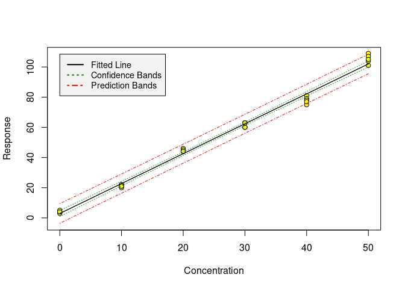

<!-- README.md is generated from README.rmd. Please edit that file -->

# chemCal - Calibration functions for analytical chemistry

<!-- badges: start -->

[](https://cran.r-project.org/package=chemCal)
[](https://app.travis-ci.com/jranke/chemCal)
[](https://app.codecov.io/gh/jranke/chemCal)
[](https://github.com/jranke/chemCal/actions/workflows/R-CMD-check.yaml)
<!-- badges: end -->

## Overview

chemCal is an R package providing some basic functions for conveniently
working with linear calibration curves with one explanatory variable.

## Installation

From within [R](https://www.r-project.org/), get the official chemCal
release using

``` r
install.packages("chemCal")
```

## Usage

chemCal works with univariate linear models of class `lm`. Working with
one of the datasets coming with chemCal, we can produce a calibration
plot using the `calplot` function:

### Plotting a calibration

``` r
library(chemCal)
m0 <- lm(y ~ x, data = massart97ex3)
calplot(m0)
```

<!-- -->

### LOD and LOQ

If you use unweighted regression, as in the above example, we can
calculate a Limit Of Detection (LOD) from the calibration data.

``` r
lod(m0)
#> $x
#> [1] 5.407085
#> 
#> $y
#> [1] 13.63911
```

This is the minimum detectable value (German: Erfassungsgrenze),
i.e. the value where the probability that the signal is not detected
although the analyte is present is below a specified error tolerance
beta (default is 0.05 following the IUPAC recommendation).

You can also calculate the decision limit (German: Nachweisgrenze), i.e.
the value that is significantly different from the blank signal with an
error tolerance alpha (default is 0.05, again following IUPAC
recommendations) by setting beta to 0.5.

``` r
lod(m0, beta = 0.5)
#> $x
#> [1] 2.720388
#> 
#> $y
#> [1] 8.314841
```

Furthermore, you can calculate the Limit Of Quantification (LOQ), being
defined as the value where the relative error of the quantification
given the calibration model reaches a prespecified value (default is
1/3).

``` r
loq(m0)
#> $x
#> [1] 9.627349
#> 
#> $y
#> [1] 22.00246
```

### Confidence intervals for measured values

Finally, you can get a confidence interval for the values measured using
the calibration curve, i.e. for the inverse predictions using the
function `inverse.predict`.

``` r
inverse.predict(m0, 90)
#> $Prediction
#> [1] 43.93983
#> 
#> $`Standard Error`
#> [1] 1.576985
#> 
#> $Confidence
#> [1] 3.230307
#> 
#> $`Confidence Limits`
#> [1] 40.70952 47.17014
```

If you have replicate measurements of the same sample, you can also give
a vector of numbers.

``` r
inverse.predict(m0, c(91, 89, 87, 93, 90))
#> $Prediction
#> [1] 43.93983
#> 
#> $`Standard Error`
#> [1] 0.796884
#> 
#> $Confidence
#> [1] 1.632343
#> 
#> $`Confidence Limits`
#> [1] 42.30749 45.57217
```

## Reference

You can use the R help system to view documentation, or you can have a
look at the [online documentation](https://pkgdown.jrwb.de/chemCal/).
